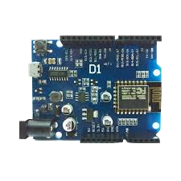
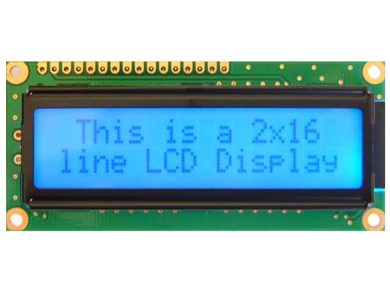
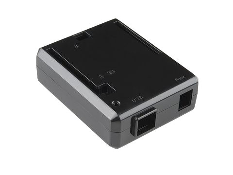

# wifi screen

is an open source IoT project.

### Main goal
Goal of this project is to have a small battery driven screen that responds to a certain WebHook calls and displays notifications on the screen.

Yes I am creating modern day pager(trying to keep everything simple).

### Inspiration
As a software developer and gamer there is usually a constant need for me to check certain things in the world of internet (If PUBG or Rust posted a new tweet about game updates, or some web server stoped working), mostly its opening a new tab just to see something that can fit in two lines..
___
### Implementation

#### Hardware
* Hearth and soul of this device is `weMOS D1` (copy of classic arduino with wifi module ESP8266).
* Second most important part is lcd display
* Last but not least is a 3d printed casing and battery pack (have not decided yet what battery to use, I am thinking about phone or a drone battery pack)

Arduino | 16x2 LCD | Battery|Case
------------|------------|------------|------------|
 ||| 
x|x|Probably not samsung :bomb:|Something like this
___
#### Software

Main (MVP) user story:

After first code upload from IDE to the Arduino D1 user should be able to configure device using the serial monitor.

Inputing 3 parameters:
* Device password (Device password is used to protect all api calls on the device)
* Wifi name
* Wifi password

Device is storing this data to EEPROM memory and is loading it every time it is turned on and trying to connect to the provided wifi network.

After connecting to wifi device shows its IP address on the display so that user can see what address to call.

Now user can use 4 api urls on that IP address:

* /display
* /destroy
* /ping
* /pingStop

###### - Display url
Calling **/display** expects 2 arguments   `line1` and `line2` and will print them on LCD display.

###### - Destroy url
Calling **/destroy** will simply delete device configuration from EEPROM and after restarting device you will need to configure it again (input wifi, wifi pass, device pass).

###### - Ping url
Calling **/ping** expects 2 arguments `pingAddress` and `refreshRate` and will do http GET call to the given `pingAddress` every `refreshRate` milliseconds.

After successful GET call it is expecting to get a JSON file as response containing `line1` and `line2` that will be displayed.

###### - Ping Stop url
Calling **/pingStop** will stop above configured pinging job if any active.

### Security

All urls are protected with basic auth where *username* is **admin** and *password* is defined by user in configuration step after uploading the code.
___
### Conclusion

For now there are 2 ways to use this device, by pushing messages to it using **/display** or letting it call some api and fetch lines from JSON using **/ping**.

#### TODO and goals for the future

Currently only done is Arduino code working on a prototype on my desk.
So obviously next thing to do is designing the 3D case and 3D printing it, selecting a battery pack and putting it to a test.
Beside that I would like to implement more things to it like:
* Buzzer (for noise alerts)
* Mobile app for communicating with its API (currently you need to use curl or postman to talk to it)
* Add led indicators (Red, Green, Blue and etc for short)
* Expend its display
